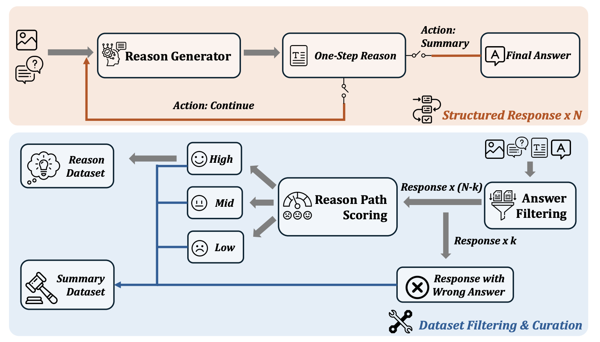
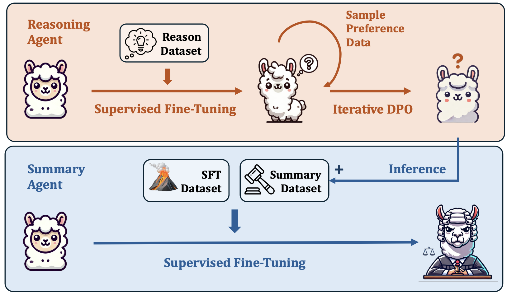
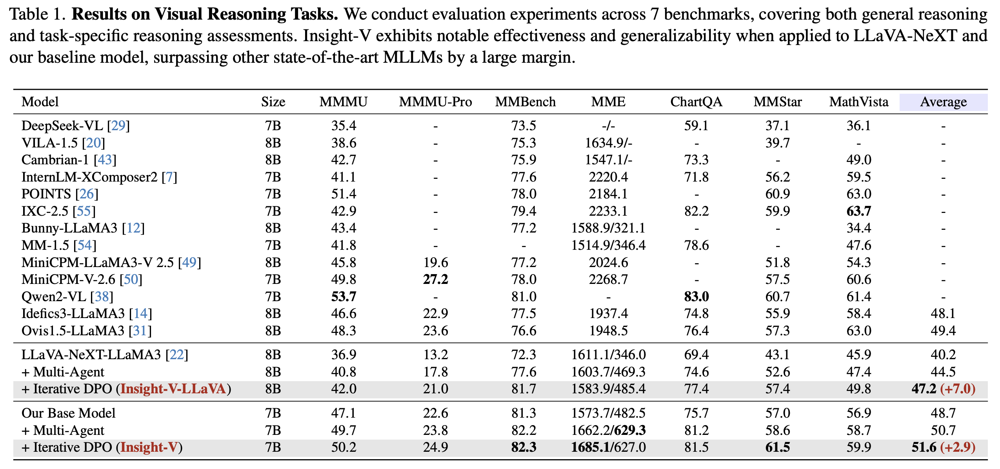
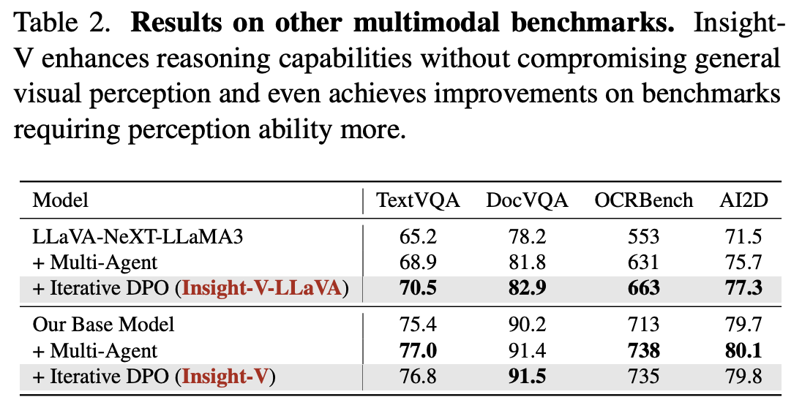
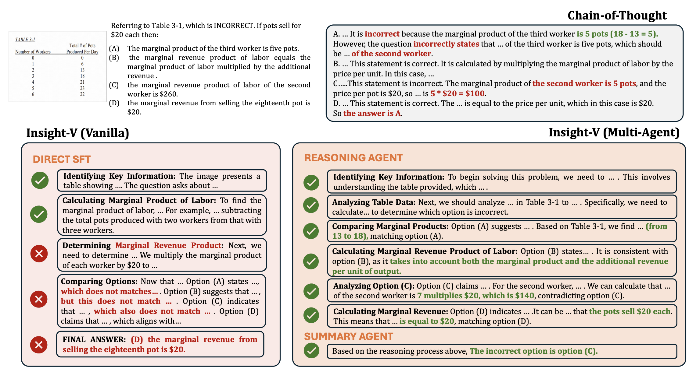

## Insight-V: Exploring Long-Chain Visual Reasoning with Multimodal Large Language Models

<p align="left">
    <a href='https://github.com/dongyh20/' target='_blank'>Yuhao Dong<sup>*,1</sup></a>&emsp;
    <a href='https://github.com/liuzuyan' target='_blank'>Zuyan Liu<sup>*,2,3</sup></a>&emsp;
    Hai-Long Sun<sup>2,4</sup></a>&emsp;
    <a href='https://jingkang50.github.io/' target='_blank'>Jingkang Yang<sup>1</sup></a>&emsp;
</p>
<p align="left">
    Winston Hu<sup>2</sup></a>&emsp;
   <a href='https://raoyongming.github.io/' target='_blank'>Yongming Rao<sup>2,3,&#x2709</sup></a>&emsp;
	 <a href='https://liuziwei7.github.io/' target='_blank'>Ziwei Liu<sup>1,&#x2709</sup></a>&emsp;
</p>

<p align="left"><sup>1</sup>S-Lab, NTU &ensp; <sup>2</sup>Tencent&ensp; <sup>3</sup>Tsinghua University&ensp;<sup>4</sup>Nanjing University&ensp; </p>

<p align="left"><sup>*</sup> Equal Contribution<sup>&ensp; &#x2709</sup>  Corresponding Author</p>

**arXiv Paper:** [](https://arxiv.org/abs/2411.14432) 

**Model Checkpoints**: [](https://huggingface.co/collections/THUdyh/insight-v-673f5e1dd8ab5f2d8d332035) 


## 📢 News
- [02/2025] Insight-V is accepted by CVPR2025!
- [11/2024] 🔧🔨**Training & Inference Scripts Release!** Try Insight-V on your own!
- [11/2024] 🔥 **🚀Introducing Insight-V!** An early attempt to explore long-chain visual reasoning with MLLMs.
  * [[Paper]](https://arxiv.org/abs/2411.14432): Detailed introduction of Insight-V, including **structured, long-chain data generation pipeline** and **effective multi-agent system design**! 
  * [[Checkpoints]](https://huggingface.co/collections/THUdyh/insight-v-673f5e1dd8ab5f2d8d332035): We release model checkpoints on LLaVA-NeXT-LLaMA3 and our base model.

## 🚀 Introducing Insight-V

### Main idea of Insight-V
**Insight-V is an early effort to explore long-chain visual reasoning with MLLMs.**

Insight-V offers **1)** a scalable data generation pipeline for long-chain, high-quality reasoning data, **2)** a multi-agent system that decomposes visual reasoning tasks into reasoning and summarization, and **3)** a two-stage training pipeline to enhance visual reasoning capabilities. Together, these contributions address key challenges in visual reasoning, providing a solid foundation for future research in MLLM reasoning.


### Overview of Data Generation Pipeline

The reasoning processes are generated progressively through a reasoning generator, and then fed into a multi-granularity assessment system to ensure high-quality reasoning.

<div align=center>

</div>

### Overview of Multi-Agent System

We derive a multi-agent system from a single model. By decomposing the task into reasoning and summarization, the two agents collaborate to enhance the overall reasoning capability.

<div align=center>

</div>


## ✅ TODO List

 - [x] Release paper on arXiv
 - [x] Release Insight-V models.
 - [ ] Demo code for generation.
 - [ ] All the training and inference code.
 - [ ] Evaluation code for visual reasoning benchmarks.
 - [ ] Insight-V SFT Data.
 - [ ] Insight-V with stronger MLLMs.

## 📃 Main Results

### Results on Visual Reasoning Benchmarks

<div align=center>

</div>


### Results on Other Image Benchmarks

<div align=center>

</div>

### Qualitative Results

<div align=center>

</div>


## Citation

If you find it useful for your research and applications, please cite our paper using this BibTeX:

```bibtex
@article{dong2024insight,
  title={Insight-V: Exploring Long-Chain Visual Reasoning with Multimodal Large Language Models},
  author={Dong, Yuhao and Liu, Zuyan and Sun, Hai-Long and Yang, Jingkang and Hu, Winston and Rao, Yongming and Liu, Ziwei},
  journal={arXiv preprint arXiv:2411.14432},
  year={2024}
}

```

## Acknowledgement

- Our codebase is conducted on [LLaVA](https://github.com/LLaVA-VL/LLaVA-NeXT)

- The data generation pipeline is mitigated from [g1](https://github.com/bklieger-groq/g1)

- Thanks to [lmms-eval](https://github.com/EvolvingLMMs-Lab/lmms-eval) team, for building such a useful evaluation system!
